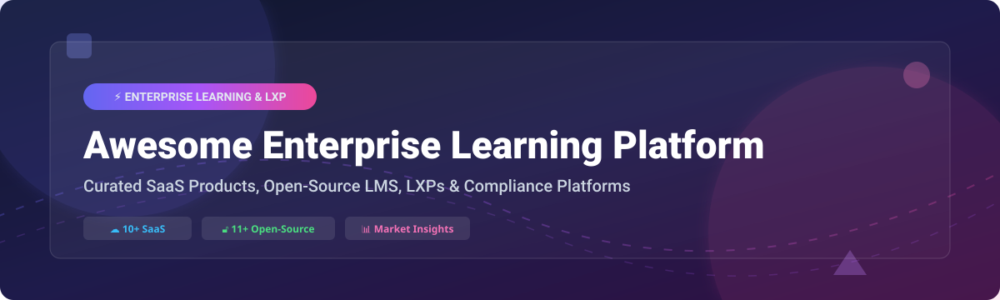

  

# 🎓 Awesome Enterprise Learning Platform & LMS

  
  
  
  
  
  

> 📚 **Curated List of SaaS Products & Open-Source GitHub Projects**
> 
> *Focused on Corporate Learning Management Systems (LMS), Learning Experience Platforms (LXP), Compliance Training, Employee Onboarding & Skills Development*
>
> 📅 **Last updated: October 2026**

---

This repository tracks notable **SaaS platforms** and **open-source projects** for **Enterprise Learning**. These tools empower human resources (HR), L&D professionals, and enterprises to deliver employee training, track regulatory compliance, nurture internal talent, and create scalable workforce learning experiences.

### 🌟 Key Highlights

- ☁️ **Commercial SaaS Leaders**: Microsoft Viva Learning, Cornerstone OnDemand, Docebo, Absorb LMS, SAP Litmos, 360Learning, Degreed, EdCast, LearnUpon, and TalentLMS.
- 🔓 **Production-Grade Open Source**: **Moodle** (300M+ users globally), **Open edX** (MOOC-scale infrastructure), **Canvas LMS** (modern UI/UX), **Chamilo**, **ILIAS**, and **Frappe LMS**.

---

## 📖 Table of Contents

- [☁️ SaaS / Hosted Platforms](#%EF%B8%8F-saas--hosted-platforms)
- [🔓 Open-Source GitHub Projects](#-open-source-github-projects)
- [🤝 How to Contribute](#-how-to-contribute)
- [☕ Support & Sponsorship](#-support--sponsorship)
- [⚠️ Disclaimer](#%EF%B8%8F-disclaimer)
- [📈 Star History](#-star-history)

---

## ☁️ SaaS / Hosted Platforms

> **📊 Market Context & Size**: The global enterprise learning platform market is estimated at **~$25 Billion in 2026**, projected to grow at a CAGR of ~12% toward **~$50 Billion by 2032**. The sector is **moderately fragmented** — vendors such as Microsoft, Cornerstone OnDemand, Docebo, SAP, and Workday lead key segments, but no single vendor holds a winner-take-all monopoly. Enterprises frequently adopt multi-vendor learning stacks.

| Platform | Description | Pricing (Starting Tier) | Free Tier / Trial Limits | Company Size (Valuation / Revenue) |
| :--- | :--- | :--- | :--- | :--- |
| **[Microsoft Viva Learning](https://www.microsoft.com/en-us/microsoft-viva/learning)** 🏢 | **Microsoft's learning platform within Viva.** Integrates LinkedIn Learning, Microsoft Learn, and 3rd-party content into M365 and Teams. | **$4.00/user/month** (annual commitment); Viva Suite: **$12.00/user/month** | **No perpetual free tier**. 30-day free trial available | **~$281B Revenue** (Microsoft FY2025) |
| **[SAP Litmos](https://www.litmos.com/)** ⚡ | **Corporate LMS for compliance and workforce training.** Platinum AI and automated course creation capabilities. | **Pro Edition**: **$7.92/user/month** (ADP Marketplace); Pro + Courses: **$19.92/user/month** | **14-day free trial**; no perpetual free tier | **~$35B Revenue** (Parent SAP) |
| **[Degreed](https://degreed.com/)** 🎯 | **Learning experience platform (LXP).** Aggregates content from multiple sources and tracks skills. | **$10,000–$25,000/year** entry-tier (100–500 users); Enterprise: **$75,000+/year** | **No free tier**; interactive enterprise demo required | **~$1.4B Valuation** (Private) |
| **[Cornerstone OnDemand](https://www.cornerstoneondemand.com/)** 🏛️ | **Comprehensive talent experience platform.** Learning, performance, recruiting, and HR modules. Ranked top 3 in ISG 2026. | **Learning module**: **$6–$10/employee/month** ($72K–$120K/year for 1,000 users); Full TXP: **$15–$25/employee/month** | **No free tier**; enterprise demo required | **~$850M+ Revenue** (CSOD) |
| **[Docebo](https://www.docebo.com/)** 🤖 | **AI-powered LMS with modern UX.** Rated Exemplary in ISG 2026. Tiers: Engage, Enterprise, Enterprise Plus. | **Custom enterprise pricing** (Engage plan starts entry-level with custom user seats) | **No perpetual free tier**; 14-day free trial available | **~$200M+ Revenue** (Public DCBO) |
| **[Absorb LMS](https://www.absorblms.com/)** 📊 | **Enterprise-grade LMS with advanced analytics and AI.** Rated Exemplary in ISG 2026. | **Mid-five figures annually** for 500+ learners (e.g., $8,594.60/quarter for 2,000 active users) | **No perpetual free tier**; free trial & sandbox available | **~$100M+ Revenue** (Private) |
| **[360Learning](https://360learning.com/)** 👥 | **Collaborative learning platform.** Peer-to-peer content creation and engagement-focused LMS. | **Team plan**: **$8.00/active user/month** (up to 100 users); Pro plan custom pricing | **No perpetual free tier**; 30-day free trial available | **~$100M+ Revenue** (Private) |
| **[LearnUpon](https://www.learnupon.com/)** 🌐 | **Unified LMS for employees, partners, and customers.** Rated Exemplary in ISG 2026. | **Custom tiered pricing** starting from 100 users (Employee), 300 users (Customer) | **No perpetual free tier**; guided demo required | **~$100M+ Revenue** (Private) |
| **[EdCast](https://www.edcast.com/)** 💡 | **Learning experience platform (LXP) with automated content curation.** | **Custom pricing** (Starting rates benchmarked at **$1.00/user/year** minimum tier) | **Free trial** & limited free evaluation plan | **Part of Cornerstone** (Acquired) |
| **[TalentLMS](https://www.talentlms.com/)** 🚀 | **Cloud LMS optimized for SMBs and mid-market teams.** | **Starter plan**: **$149.00/month** (up to 40 users); Standard: **$299.00/month** | **Free tier**: Up to **5 users**, 10 courses, limited features | **Part of Epignosis** |

---

## 🔓 Open-Source GitHub Projects

Below are production-tested open-source learning management systems and platforms, sorted by **GitHub Stars_Count (descending)**.

| Repo & Description | GitHub_Stars |
| :--- | :--- |
| 🎓 **[Open edX](https://github.com/openedx/edx-platform)** **Best for MOOCs and massive-scale learning.** Built by MIT and Harvard to power edX.org. Offers video learning paths, discussion forums, auto-graded exercises, and certificate issuance. Scalable to millions of learners. *(AGPL-3.0)* |  |
| 🏫 **[Moodle](https://github.com/moodle/moodle)** **The most widely deployed open-source LMS globally.** Used by 300M+ users across 240+ countries. Features 2,000+ plugins, full SCORM 1.2/2004 & LTI compliance, 40+ quiz question types, and competency tracking. *(GPL-3.0)* |  |
| 🎨 **[Canvas LMS](https://github.com/instructure/canvas-lms)** **Best UI/UX among open-source LMS.** Developed by Instructure with a modern web interface, clean assignment workflows, speedgrader tools, and extensible REST APIs. *(AGPL-3.0)* |  |
| ⚡ **[Frappe LMS](https://github.com/frappe/lms)** **Modern, full-stack open-source LMS.** Built on the Python/JS Frappe Framework. Easy setup, course builder, quizzes, student portals, and clean modern aesthetics. *(GPL-3.0)* |  |
| 📡 **[Kolibri](https://github.com/learningequality/kolibri)** **Best for offline and low-bandwidth environments.** Lightweight learning application designed to bridge the digital divide in remote areas. Minimal hardware footprint. *(MIT)* |  |
| 📚 **[Gibbon](https://github.com/GibbonEdu/core)** **Flexible open-source school & learning management platform.** Flexible PHP architecture covering lesson planning, student assessment, markbooks, and timetable scheduling. *(GPL-3.0)* |  |
| 🌲 **[Chamilo](https://github.com/chamilo/chamilo-lms)** **Best lightweight LMS for small-to-mid teams.** Easy administration, low server overhead (2 GB RAM recommended), quizzes, BigBlueButton integration, and SCORM support. *(GPL-3.0)* |  |
| 🏛️ **[Sakai](https://github.com/sakaiproject/sakai)** **Enterprise higher-ed and corporate collaboration environment.** Java-based platform providing robust course authoring, grading, and group collaboration tools. *(ECL-2.0)* |  |
| 🛡️ **[ILIAS](https://github.com/ILIAS-eLearning/ILIAS)** **Best for corporate compliance & security-conscious teams.** German-engineered LMS featuring rigorous competency management, assessment engines, and SCORM 2004 support. *(GPL-3.0)* |  |
| 🇨🇭 **[OpenOLAT](https://github.com/OpenOLAT/OpenOLAT)** **Swiss open-source LMS for learning & training.** Java-based learning management system tailored for university and corporate continuing education. *(Apache-2.0)* |  |
| 🧩 **[LearnDash Core](https://github.com/LearnDashHQ/learndash)** **Popular WordPress LMS codebase.** Core open-source components for building e-learning courses on WordPress ecosystems. *(GPL-2.0)* |  |

---

## 🤝 How to Contribute

Contributions are welcome! Please follow these simple guidelines:

1. 🍴 **Fork** this repository.
2. 📝 Edit `README.md` to add your proposed platform or project (ensure proper Markdown formatting).
3. 🔎 Provide details including category, pricing/license, free tier limits, and starry badge links.
4. 🚀 Submit a **Pull Request** with a clear title and context.

Check out our curated meta-list at [Awesome-Awesome-Awesome](https://github.com/ishandutta2007/Awesome-Awesome-Awesome) for more curated resources!

---

## ☕ Support & Sponsorship

If you find this repository helpful for evaluating enterprise learning systems or building educational tech stacks, please consider showing your support:

- ⭐ **Star** this repository to increase its visibility.
- 🔀 **Fork** and share it with your L&D and engineering teams.
- ☕ **Buy me a coffee / Sponsor**: Support ongoing maintenance on the [GitHub Sponsor Dashboard](https://github.com/sponsors/ishandutta2007).

Thank you for supporting open-source software and knowledge sharing! ❤️

---

## ⚠️ Disclaimer

- This list is **community-curated** for research purposes and does not constitute endorsement.
- Ensure all selected platforms comply with organizational data governance, **GDPR**, and **SOC 2** standards.
- **Pricing note**: Commercial software prices fluctuate based on contract size and active learner count. Always request an official quote from vendors.

---

## 📈 Star History

---

  <b>Made with ❤️ for L&D leaders, HR professionals, and E-Learning developers worldwide.</b>

